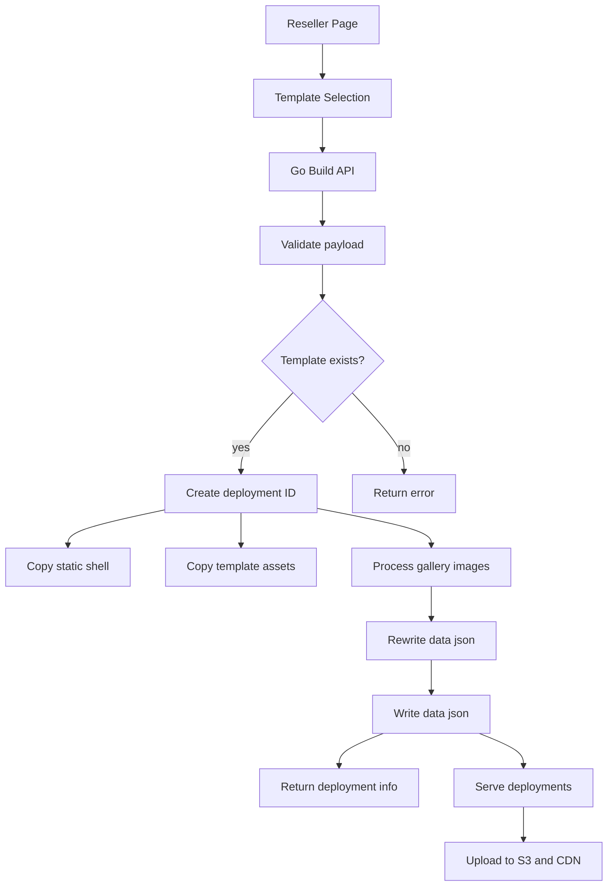
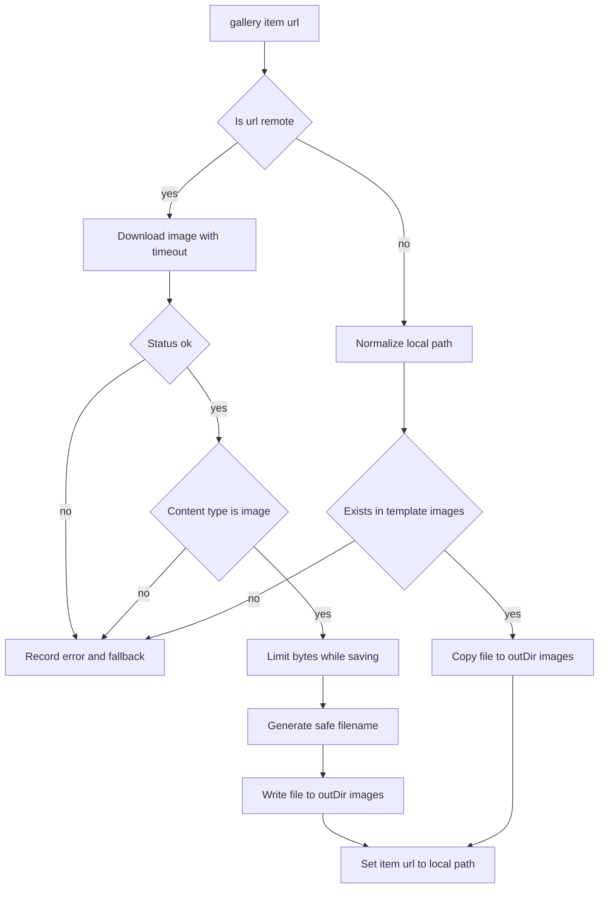
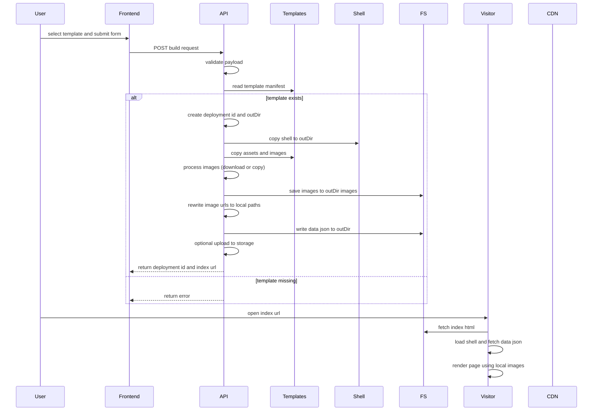
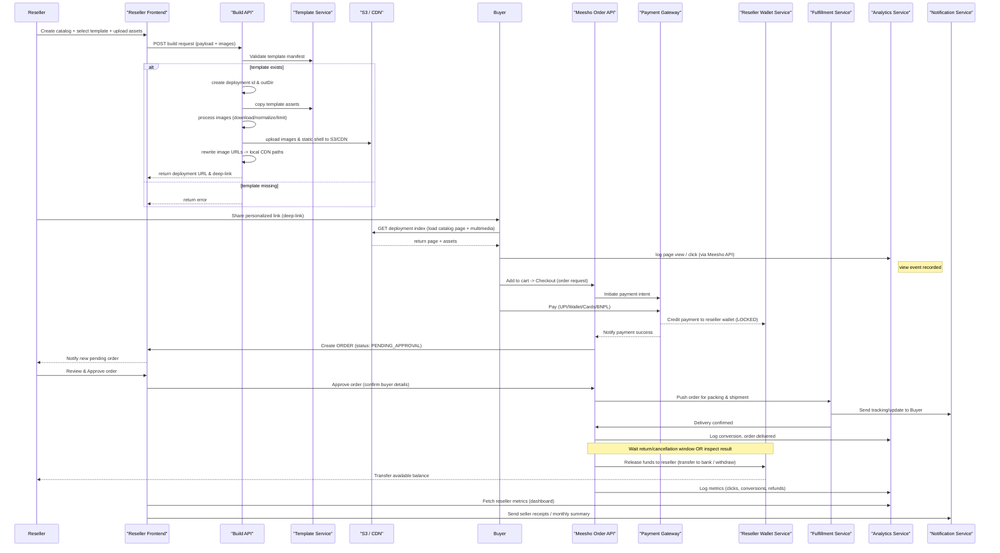

# System Design Diagrams

## 1. High-level Flowchart

```mermaid
flowchart TD
  U[Reseller Page]
  F[Template Selection]
  S[Go Build API]
  V[Validate payload]
  D{Template exists?}
  C[Create deployment ID]
  CS[Copy static shell]
  CA[Copy template assets]
  PG[Process gallery images]
  RW[Rewrite data json]
  WD[Write data json]
  R[Return deployment info]
  SV[Serve deployments]
  OPT[Upload to S3 and CDN]
  ERR[Return error]

  U --> F
  F --> S
  S --> V
  V --> D
  D -- yes --> C
  D -- no --> ERR
  C --> CS
  C --> CA
  C --> PG
  PG --> RW
  RW --> WD
  WD --> R
  WD --> SV
  SV --> OPT
```

 
 
The image flow (not really useful this but okay)

```mermaid
flowchart TB
  Start[gallery item url]
  Start --> IsRemote{Is url remote}
  IsRemote -- yes --> Download[Download image with timeout]
  Download --> CheckStatus{Status ok}
  CheckStatus -- no --> Error[Record error and fallback]
  CheckStatus -- yes --> CheckType{Content type is image}
  CheckType -- no --> Error
  CheckType -- yes --> Limit[Limit bytes while saving]
  Limit --> Name[Generate safe filename]
  Name --> Save[Write file to outDir images]
  Save --> SetUrl[Set item url to local path]
  IsRemote -- no --> Normalize[Normalize local path]
  Normalize --> Exists{Exists in template images}
  Exists -- yes --> Copy[Copy file to outDir images]
  Copy --> SetUrl
  Exists -- no --> Error
```
 
 

The seq flow

```mermaid
sequenceDiagram
  participant User
  participant Frontend
  participant API
  participant Templates
  participant Shell
  participant FS
  participant Visitor
  participant CDN

  User->>Frontend: select template and submit form
  Frontend->>API: POST build request
  API->>API: validate payload
  API->>Templates: read template manifest
  alt template exists
    API->>API: create deployment id and outDir
    API->>Shell: copy shell to outDir
    API->>Templates: copy assets and images
    API->>API: process images (download or copy)
    API->>FS: save images to outDir images
    API->>API: rewrite image urls to local paths
    API->>FS: write data json to outDir
    API->>API: optional upload to storage
    API-->>Frontend: return deployment id and index url
  else template missing
    API-->>Frontend: return error
  end
  User->>Visitor: open index url
  Visitor->>FS: fetch index html
  Visitor->>Visitor: load shell and fetch data json
  Visitor->>Visitor: render page using local images
```

## 2.

```mermaid
sequenceDiagram
  participant Reseller
  participant ResellerFrontend as "Reseller Frontend"
  participant BuildAPI as "Build API"
  participant TemplateSvc as "Template Service"
  participant Storage as "S3 / CDN"
  participant Buyer
  participant MeeshoAPI as "Meesho Order API"
  participant PaymentGW as "Payment Gateway"
  participant Wallet as "Reseller Wallet Service"
  participant Fulfill as "Fulfillment Service"
  participant Analytics as "Analytics Service"
  participant Notify as "Notification Service"

  %% Reseller creates a personalized catalog / link
  Reseller->>ResellerFrontend: Create catalog + select template + upload assets
  ResellerFrontend->>BuildAPI: POST build request (payload + images)
  BuildAPI->>TemplateSvc: Validate template manifest
  alt template exists
    BuildAPI->>BuildAPI: create deployment id & outDir
    BuildAPI->>TemplateSvc: copy template assets
    BuildAPI->>BuildAPI: process images (download/normalize/limit)
    BuildAPI->>Storage: upload images & static shell to S3/CDN
    BuildAPI->>BuildAPI: rewrite image URLs -> local CDN paths
    BuildAPI-->>ResellerFrontend: return deployment URL & deep-link
  else template missing
    BuildAPI-->>ResellerFrontend: return error
  end

  %% Reseller shares link and buyer visits
  Reseller->>Buyer: Share personalized link (deep-link)
  Buyer->>Storage: GET deployment index (load catalog page + multimedia)
  Storage-->>Buyer: return page + assets
  Buyer->>Analytics: log page view / click (via Meesho API)
  Note right of Analytics: view event recorded

  %% Buyer places order via the shared catalog
  Buyer->>MeeshoAPI: Add to cart -> Checkout (order request)
  MeeshoAPI->>PaymentGW: Initiate payment intent
  Buyer->>PaymentGW: Pay (UPI/Wallet/Cards/BNPL)
  PaymentGW-->>Wallet: Credit payment to reseller wallet (LOCKED)
  PaymentGW-->>MeeshoAPI: Notify payment success

  %% Order created as pending approval to avoid false positives
  MeeshoAPI->>ResellerFrontend: Create ORDER (status: PENDING_APPROVAL)
  ResellerFrontend-->>Reseller: Notify new pending order
  Reseller->>ResellerFrontend: Review & Approve order
  ResellerFrontend->>MeeshoAPI: Approve order (confirm buyer details)
  MeeshoAPI->>Fulfill: Push order for packing & shipment
  Fulfill->>Notify: Send tracking/update to Buyer
  Fulfill->>MeeshoAPI: Delivery confirmed
  MeeshoAPI->>Analytics: Log conversion, order delivered

  %% Funds release after risk window / returns closed
  Note over Wallet,MeeshoAPI: Wait return/cancellation window OR inspect result
  MeeshoAPI->>Wallet: Release funds to reseller (transfer to bank / withdraw)
  Wallet-->>Reseller: Transfer available balance

  %% Dashboard & additional features
  MeeshoAPI->>Analytics: Log metrics (clicks, conversions, refunds)
  ResellerFrontend->>Analytics: Fetch reseller metrics (dashboard)
  ResellerFrontend->>Notify: Send seller receipts / monthly summary
```